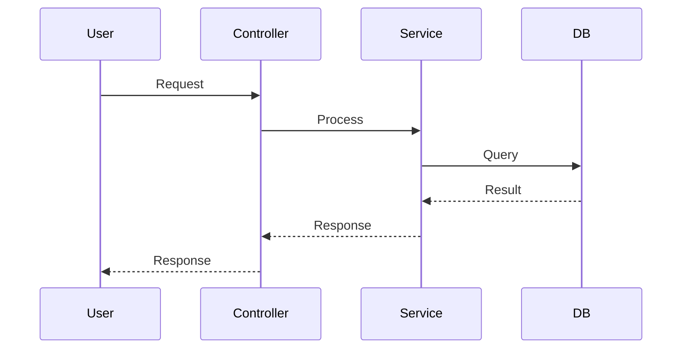

# 详细设计文档模板

## 1. 引言
### 1.1 背景
[简要描述项目背景，来源于 proposal.md]

### 1.2 目标
[描述设计目标，来源于 proposal.md]

## 2. 系统架构

### 2.1 模块交互图 (Sequence Diagram)
[使用 Mermaid 绘制核心业务流程的时序图，展示模块间的交互]


### 2.2 模块划分
- **Controller层**: [描述 API 入口]
- **Service层**: [描述核心业务逻辑]
- **Mapper/DAO层**: [描述数据持久化]

## 3. 接口设计 (API Design)
> 请遵循 `java-common-standards.mdc` 中的 RESTful 规范

### 3.1 接口列表
| 接口名称 | 方法 | URL | 描述 |
| :--- | :--- | :--- | :--- |
| [示例: 创建用户] | POST | /api/v1/users | [描述] |

### 3.2 接口详情
#### [接口名称]
- **功能描述**: ...
- **请求参数 (Request Body/Params)**:
  ```json
  {
    "field1": "value", // [说明]
    "field2": 123
  }
  ```
- **响应参数 (Response Body)**:
  ```json
  {
    "code": 200,
    "msg": "success",
    "data": { ... }
  }
  ```

## 4. 数据模型 (Schema Design)
> 请遵循 `java-common-standards.mdc` 中的命名规范 (如: `XxxPO`, `XxxMapper`)

### 4.1 ER图 / 表结构
[描述变更涉及的表结构，包括字段、类型、主键、索引]

```sql
CREATE TABLE `t_example` (
  `id` bigint(20) NOT NULL AUTO_INCREMENT COMMENT '主键ID',
  `name` varchar(64) NOT NULL COMMENT '名称',
  ...
  PRIMARY KEY (`id`)
) COMMENT='示例表';
```

## 5. 核心业务逻辑 (Business Logic)
### 5.1 [逻辑点 1]
- **输入**: ...
- **处理步骤**:
    1. ...
    2. ...
- **输出**: ...
- **异常处理**: [参考 java-common-standards.mdc 中的异常规范]

## 6. 安全与性能
- **鉴权**: [如: 需要登录、角色权限]
- **性能**: [如: 缓存策略、索引优化]
- **事务**: [如: `@Transactional` 事务边界]
