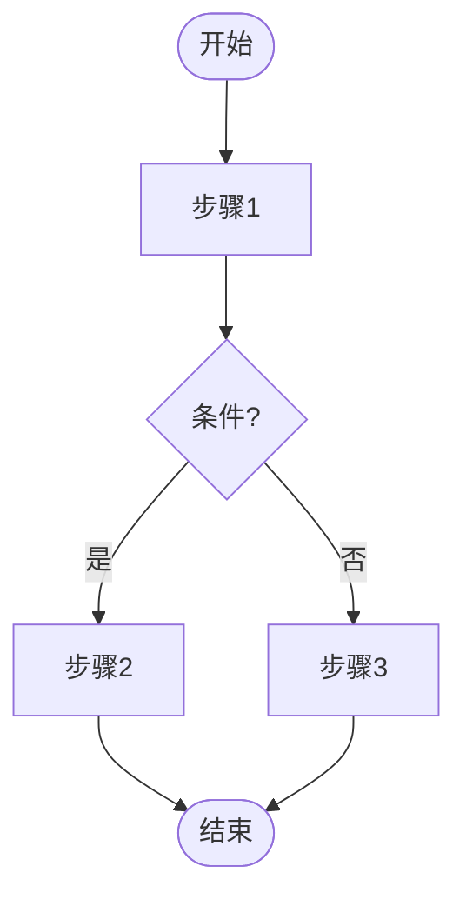
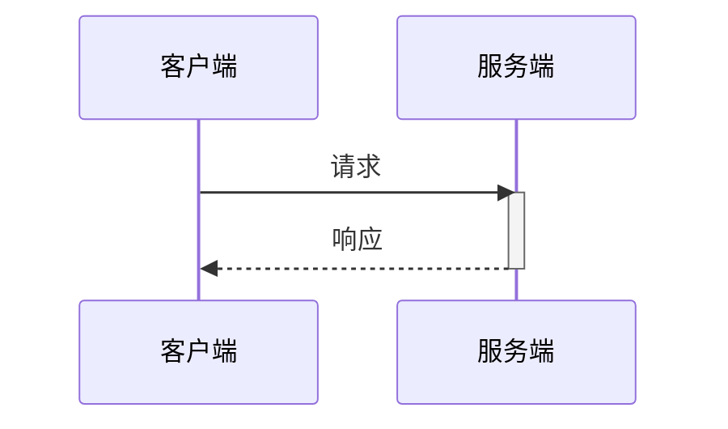

# Mermaid 图表生成规范

<mandatory>
核心目标: **零语法错误**。以下规则必须严格执行,违反将导致渲染失败。
</mandatory>

---

## 红线规则(强制执行)

<constraints>
以下规则**禁止违反**,违反将直接导致渲染失败:

| 规则 | 禁止 | 正确 | 违反后果 |
|------|------|------|----------|
| 节点ID纯英文 | `用户[User]` | `user[User]` | 解析失败 |
| 特殊字符必须包裹 | `n1[用户(VIP)]` | `n1["用户(VIP)"]` | 括号被误识别 |
| 禁止中文标点 | `n1["状态：已完成"]` | `n1["状态: 已完成"]` | 解析失败 |
| subgraph必须闭合 | `subgraph A ... subgraph B ... end` | `subgraph A ... end subgraph B ... end` | 结构错误 |
| activate必须配对 | `activate S`(无deactivate) | `activate S ... deactivate S` | 时序图崩溃 |
</constraints>

---

## 节点 ID 规范

<rule>
- **必须**: 英文字母+数字组合(`node1`/`stepA`/`svc_auth`)
- **禁止**: 中文、空格、特殊符号作为 ID
- **禁止**: 同一图内 ID 重复
</rule>

---

## 节点文字规范

<rule>
**铁律: 含以下任一字符,必须用双引号包裹整个文字。**

必须包裹的字符: `() [] {} <> | & -- # : ; @ %% " ' / \ ~ $`

```text
✅ node1["用户登录(OAuth)"]
✅ node2["状态: 已完成"]
✅ node3["GET /api/users"]
❌ node1[用户登录(OAuth)]     ← () 被误识别为节点定义
❌ node2[状态: 已完成]        ← : 被误识别为样式分隔
```
</rule>

---

## 结构闭合检查

<rule>
- **强制**: 每个 `subgraph` 必须有对应的 `end`
- **自检**: 输出前数一数, `subgraph` 数量 = `end` 数量
- **禁止**: 嵌套 subgraph(容易导致闭合错误)
</rule>

---

## 箭头与连接线

- 统一使用 `-->` 或 `---`,不混用风格
- 带文字: `A -->|文字| B`
- 连接文字保持简短,不含特殊符号

---

## 标点符号规范

<rule>
**全部使用英文标点,中文标点必然导致解析失败:**

| 禁止(解析失败) | 正确 |
|-----------------|------|
| ： | : |
| （） | () |
| “” | "" |
| ； | ; |
| ， | , |
</rule>

---

## 禁用语法

<rule>
以下语法**禁止使用**,兼容性差:
- `%%` 注释
- `callback`、`click` 交互语法
- 嵌套 subgraph
- `&` 并行语法
</rule>

---

## 输出格式要求

1. 代码块使用 ` ```mermaid ` 标记
2. 图表类型声明放在第一行
3. 每个节点定义独占一行
4. 适当空行分隔逻辑块

---

## 各图表类型要点

| 图表类型 | 核心要点 |
|---------|----------|
| **流程图** | `flowchart TD/LR`、判断`{}`、开始/结束`([])` |
| **时序图** | `participant FE as 前端`、`activate/deactivate`配对、`loop/alt/opt`必须有`end` |
| **类图** | PascalCase类名、`+/-/#`可见性、`<|--`继承`*--`组合 |
| **状态图** | `stateDiagram-v2`、`[*]`表示初始/结束 |

---

## 生成后强制自检

<checklist>
输出 Mermaid 代码前,**必须**逐项检查:

1. **节点ID**: 无中文、无空格、无重复
2. **特殊字符**: 含 `()[]{}:<>|&` 等已用双引号包裹
3. **标点符号**: 无中文标点(：（），；)
4. **结构闭合**: subgraph 数量 = end 数量
5. **时序图**: activate/deactivate 已配对
6. **代码块**: 标记为 ```mermaid
</checklist>

---

## 常用模板

### 流程图



### 时序图



### 状态图

```mermaid
stateDiagram-v2
    [*] --> 待处理
    待处理 --> 处理中 --> 已完成 --> [*]
```
