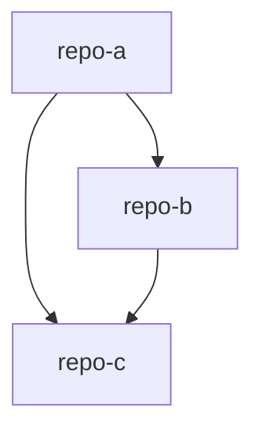
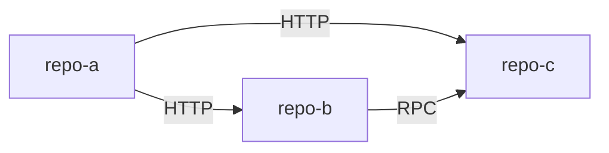
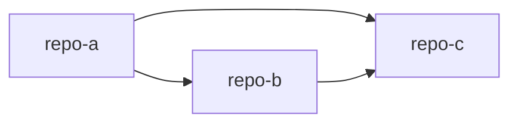

# 项目群文档模板

## 项目群总览.mdc

````markdown
---
description: '项目群总览 - 项目群包含什么、各仓库职责；当需要了解各仓库定位和协作关系时使用'
alwaysApply: false
---

# 项目群总览

<!-- AI生成，可根据团队规范更新 -->

## 项目群定位

**名称**：{项目群名称}

**定位**：{一句话描述}

**为什么这些仓库要一起管理**：{说明仓库间的关联性}

## 子仓库概览

| 仓库   | 核心职责 | 技术栈   | 与其他仓库的关系            |
| ------ | -------- | -------- | --------------------------- |
| repo-a | {职责}   | {技术栈} | 调用 repo-b                 |
| repo-b | {职责}   | {技术栈} | 被 repo-a 调用，依赖 repo-c |
| repo-c | {职责}   | {技术栈} | 被 repo-a、repo-b 依赖      |

## 仓库关系说明

{描述这些仓库是如何协作的，数据/请求如何在仓库间流转}

## 项目群架构图


````

---

## 系统拓扑.mdc

````markdown
---
description: '系统拓扑 - 项目间调用关系、数据流向；当需要了解仓库间调用链路或数据流转时使用'
alwaysApply: false
---

# 系统拓扑

<!-- AI生成，可根据团队规范更新 -->

## 调用关系总览



## 调用关系详情

| 调用方 | 被调用方 | 调用方式 | 说明       |
| ------ | -------- | -------- | ---------- |
| repo-a | repo-b   | HTTP     | {具体说明} |
| repo-a | repo-c   | HTTP     | {具体说明} |
| repo-b | repo-c   | RPC      | {具体说明} |

## 关键数据流路径

### 路径 1: {场景名称}

```
用户请求 → repo-a → repo-b → 数据库 → 返回
```

### 路径 2: {场景名称}

```
{描述数据如何在仓库间流转}
```

## 共享基础设施

| 基础设施 | 类型             | 使用的仓库 | 用途   |
| -------- | ---------------- | ---------- | ------ |
| {名称}   | {数据库/缓存/MQ} | {仓库列表} | {用途} |
````

---

## 接口契约.mdc

````markdown
---
description: '接口契约 - 跨仓库的接口定义、共享数据结构；当需要了解仓库间接口格式时使用'
alwaysApply: false
---

# 接口契约

<!-- AI生成，可根据团队规范更新 -->

## 共享数据结构

> 列出在多个仓库间共享的数据结构/类型定义

### {数据结构名称}

```typescript
// 定义位置：{仓库/文件路径}
// 使用的仓库：{仓库列表}

interface {Name} {
  // 字段定义
}
```

## 跨仓库接口契约

> 列出仓库间调用的关键接口

### {接口名称}

| 属性     | 值             |
| -------- | -------------- |
| 提供方   | {仓库名}       |
| 调用方   | {仓库名}       |
| 调用方式 | {HTTP/RPC/...} |
| 接口标识 | {端点/方法名}  |

**输入**：

```json
{输入格式}
```

**输出**：

```json
{输出格式}
```

## 共享约定

| 约定项   | 规则       | 适用仓库   |
| -------- | ---------- | ---------- |
| {约定名} | {规则说明} | {仓库列表} |
````

---

## 变更影响.mdc

````markdown
---
description: '变更影响 - 改了这里还要改哪里；当修改某仓库代码需要评估对其他仓库的影响时使用'
alwaysApply: false
---

# 变更影响

<!-- AI生成，可根据团队规范更新 -->

## 变更影响速查

> 当你修改某个仓库的代码时，参考此表确认是否需要同步修改其他仓库。

## 仓库间依赖关系



| 仓库   | 依赖的仓库     | 被依赖的仓库   |
| ------ | -------------- | -------------- |
| repo-a | repo-b, repo-c | -              |
| repo-b | repo-c         | repo-a         |
| repo-c | -              | repo-a, repo-b |

**依赖方向说明**：当 repo-c 变更时，repo-a 和 repo-b 可能都需要适配。

## 接口变更影响

| 变更位置               | 影响的仓库     | 需同步修改的内容      |
| ---------------------- | -------------- | --------------------- |
| repo-b: 某接口签名变更 | repo-a         | 调用处、类型定义      |
| repo-c: 导出函数变更   | repo-a, repo-b | import 语句、调用方式 |

## 变更检查清单

### 修改被依赖仓库时

- [ ] 所有依赖方是否已确认影响？
- [ ] 接口签名变更是否向后兼容？
- [ ] 是否需要协调发布顺序？

### 修改共享内容时

- [ ] 所有使用方是否已测试？
- [ ] 版本号是否已更新？
````

---

## 联调指南.mdc

````markdown
---
description: '联调指南 - 多仓库本地开发、联调方法；当需要本地启动多个仓库进行联调时使用'
alwaysApply: false
---

# 联调指南

<!-- AI生成，可根据团队规范更新 -->

## 推荐目录结构

```
workspace/                        # 工作区根目录
├── repo-a/                       # 仓库 A
├── repo-b/                       # 仓库 B
├── repo-c/                       # 仓库 C
└── .cursor/rules/ai-readme/      # 项目群上下文
```

## 启动顺序

### 依赖关系


### 各仓库启动命令

| 仓库   | 启动命令 | 端口   |
| ------ | -------- | ------ |
| repo-c | `{命令}` | {端口} |
| repo-b | `{命令}` | {端口} |
| repo-a | `{命令}` | {端口} |

## 常见开发场景

### 场景 1：{场景描述}

1. {步骤 1}
2. {步骤 2}
3. {步骤 3}
````
