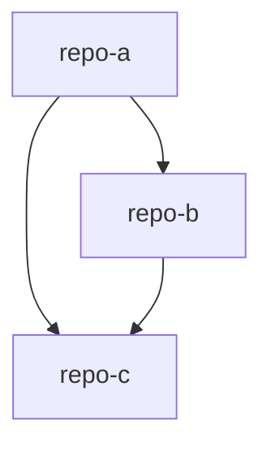

# 项目群 RULE.mdc 模板

## 完整模板

````markdown
---
description: '多仓库项目群必读入口 - 项目群总览和导航；开始任何任务前必须先读取本文件，了解项目群上下文和仓库关系'
alwaysApply: false
---

# {项目群名称} - 项目群上下文

<!-- AI生成，可根据团队规范更新 -->

<project_overview>

## 项目群简介

{一句话描述项目群}
</project_overview>

<generation_info>

## 生成信息

- **生成时间**: {YYYY-MM-DD HH:mm:ss}
- **子仓库快照**: - {repo-name}: {commit-short} ({branch}) - {repo-name}: {commit-short} ({branch})
  </generation_info>

<repo_list>

## 子仓库清单

| 仓库        | 职责   | 与其他仓库的关系 | 路径       |
| ----------- | ------ | ---------------- | ---------- |
| {repo-name} | {职责} | {关系说明}       | {相对路径} |
| {repo-name} | {职责} | {关系说明}       | {相对路径} |

## 仓库关系图



</repo_list>

<quick_navigation>

## 快速导航

| 文档                           | 说明                       | 状态 |
| ------------------------------ | -------------------------- | ---- |
| [项目群总览](./项目群总览.mdc) | 项目群包含什么、各仓库职责 | [ ]  |
| [系统拓扑](./系统拓扑.mdc)     | 调用关系、数据流向         | [ ]  |
| [接口契约](./接口契约.mdc)     | 跨仓库接口定义、共享类型   | [ ]  |
| [变更影响](./变更影响.mdc)     | 改了这里还要改哪里         | [ ]  |
| [联调指南](./联调指南.mdc)     | 本地联调开发方法           | [ ]  |

</quick_navigation>
````

## 状态列说明

| 状态  | 含义                           |
| ----- | ------------------------------ |
| `[ ]` | 未完成，需要生成               |
| `[x]` | 已完成（生成完成后追加时间戳） |
| `[?]` | 待确认（中间状态）             |

**已完成的状态格式**：`[x] YYYY-MM-DD HH:mm:ss`

## XML 标签说明

| 标签                 | 用途                | 模型行为                         |
| -------------------- | ------------------- | -------------------------------- |
| `<project_overview>` | 项目群简介          | 快速理解项目群定位               |
| `<generation_info>`  | 生成快照            | 追溯文档版本                     |
| `<repo_list>`        | 仓库清单和关系图    | 了解仓库间关系                   |
| `<quick_navigation>` | 文件导航 + 生成进度 | 按需跳转到具体文档，支持断点续写 |
