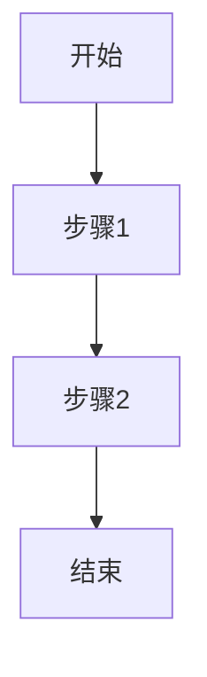
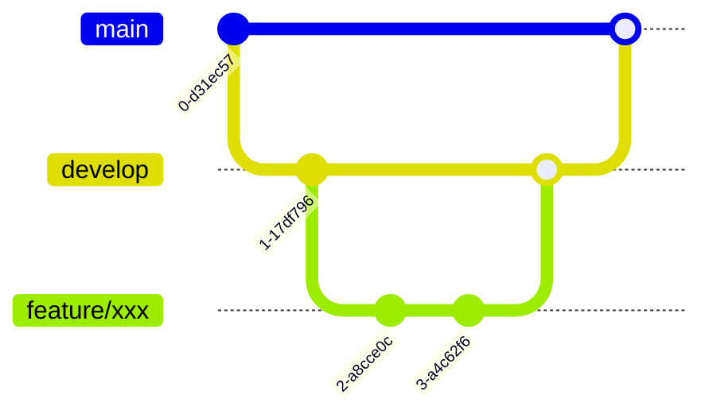

# manual/ 文档模板

## 备忘.mdc

> 用途：记录用户偏好，让下一次执行本命令时不跑偏（尤其用于 `generated/核心流程.mdc` 的确认口径）。
> 规则：**仅在不存在时创建**；已存在时只读不覆盖（除非用户明确要求重置）。

```markdown
---
description: '备忘 - 用户偏好与关键确认点；当需要在每次执行 ai-readme 前对齐偏好时使用'
alwaysApply: false
---

# 备忘（用户偏好）

> 说明：本文件用于记录"你希望 AI README 怎么写"的偏好。
> 每次执行 `ai-readme` 命令前，必须先读一遍本文件，并把这里的偏好作为最高优先级约束。
> 请尽量写清楚"你要什么 / 你不要什么"，尤其是 **核心流程** 应该如何确认。

## 核心流程（必须确认）

<!-- TODO: 写清楚你们认为的 P0/P1 核心流程是什么，AI 输出时必须先让你确认是否跑偏 -->

- P0 核心流程（必写）：<!-- TODO: 填写 -->
- P1 核心流程（选写）：<!-- TODO: 填写 -->
- 明确不要写成"核心流程"的内容：<!-- TODO: 填写 -->

## 约束与禁忌（不要跑偏）

<!-- TODO: 写清楚哪些内容不要猜、哪些必须问你确认 -->
```

---

## 业务知识.mdc

````markdown
---
description: '业务知识 - 项目背景、领域术语、业务流程和规则；当需要理解业务上下文时使用'
alwaysApply: false
---

# 业务知识

## 项目背景

### 项目是什么

<!-- TODO: 一句话描述项目 -->

### 解决什么问题

<!-- TODO: 描述项目要解决的核心问题 -->

### 服务谁

<!-- TODO: 描述目标用户群体 -->

## 领域术语

| 术语 | 英文/代码名 | 业务含义 |
| ---- | ----------- | -------- |

<!-- TODO: 填写项目中的专有名词及其业务含义 -->

## 业务流程

### 核心流程

<!-- TODO: 用 Mermaid 流程图描述核心业务流程 -->



### 流程说明

<!-- TODO: 补充业务层面的流程描述、分支条件 -->

## 业务规则

### 状态流转规则

<!-- TODO: 描述业务对象的状态流转 -->

### 计算规则

<!-- TODO: 描述业务计算规则（如金额、积分等） -->

### 业务约束

<!-- TODO: 描述业务限制条件 -->
````

---

## 边界定义.mdc

```markdown
---
description: '边界定义 - 模块职责边界和跨仓库协作关系；当需要明确模块职责或跨项目协作时使用'
alwaysApply: false
---

# 边界定义

## 模块职责矩阵

| 模块 | 负责 | 不负责 |
| ---- | ---- | ------ |

<!-- TODO: 填写每个模块的职责边界 -->

## 模块间协作规则

<!-- TODO: 描述模块间如何协作 -->

## 跨仓库协作

### 关联仓库清单

| 仓库名 | 职责 | 协作方式 |
| ------ | ---- | -------- |

<!-- TODO: 填写关联仓库及协作关系 -->

### 接口约定

<!-- TODO: 描述跨仓库的接口约定 -->

## 边界设计原则

<!-- TODO: 描述边界划分的设计原则 -->
```

---

## 团队标准.mdc

````markdown
---
description: '团队标准 - Git规范、质量门禁和Review约定；当需要了解团队开发规范时使用'
alwaysApply: false
---

# 团队标准

## Git 规范

### 分支策略



<!-- TODO: 确认以下分支策略是否符合团队习惯 -->

| 分支类型 | 命名规则    | 用途     |
| -------- | ----------- | -------- |
| main     | main        | 生产环境 |
| develop  | develop     | 开发环境 |
| feature  | feature/xxx | 功能开发 |
| hotfix   | hotfix/xxx  | 紧急修复 |

### Commit 规范

<!-- TODO: 确认提交格式 -->

```
<type>(<scope>): <subject>

feat: 新功能
fix: 修复 bug
docs: 文档更新
style: 代码格式
refactor: 重构
test: 测试相关
chore: 构建/工具
```

## 质量门禁

<!-- TODO: 描述代码合并前的检查项 -->

| 检查项   | 要求        | 工具        |
| -------- | ----------- | ----------- |
| 单元测试 | 覆盖率 > X% | Jest/Vitest |
| Lint     | 无错误      | ESLint      |
| 类型检查 | 无错误      | TypeScript  |

## Code Review 规范

<!-- TODO: 描述 Review 关注点 -->

### Review 清单

- [ ] 代码逻辑正确
- [ ] 边界条件处理
- [ ] 错误处理完善
- [ ] 命名规范
- [ ] 有必要的注释

## 团队约定

<!-- TODO: 描述团队的隐性约定 -->

## 特殊场景处理

<!-- TODO: 描述紧急修复等特殊场景的处理方式 -->
````

---

## 历史经验.mdc

```markdown
---
description: '历史经验 - 踩坑记录；AI写代码或做方案前必读，避免重复踩坑'
alwaysApply: false
---

# 历史经验

> ⚠️ **AI 必读**：写代码或做方案前先看这里，避免重复踩坑。

## 踩坑记录

<!-- TODO: 记录踩过的坑（问题 → 原因 → 方案） -->
```
