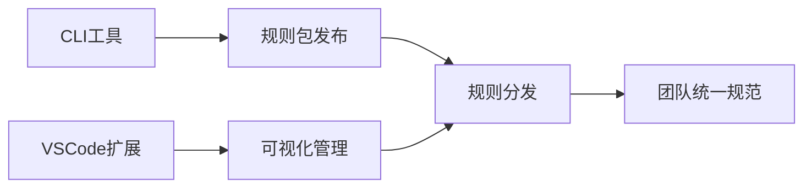

# RULE.mdc 入口文件模板

## 完整模板

````markdown
---
description: 'AI README 必读入口 - 项目规则导航；开始任何任务前必须先读取本文件，了解项目上下文和规则清单'
alwaysApply: false
---

# AI README - 项目规则入口

<project_overview>

## 项目总览

<!-- 项目架构图、一句话描述 -->


````

**核心能力**：{一句话描述}
</project_overview>

<generation_info>

## 生成信息

- **生成分支**: {branch}
- **生成 Commit**: {commit}
- **生成时间**: {YYYY-MM-DD HH:mm:ss}
  </generation_info>

<quick_navigation>

## 快速导航

### 用户偏好备忘（固定）

- [S] [备忘](./备忘.mdc) - 用户偏好与关键确认点；每次执行本命令前必读

### AI 生成文档（generated/）

- [ ] [项目结构](./generated/项目结构.mdc) - 目录树、模块划分、依赖关系；当需要了解代码组织时使用
- [ ] [技术架构](./generated/技术架构.mdc) - 分层架构、技术栈清单；当需要了解技术选型时使用
- [ ] [开发指南](./generated/开发指南.mdc) - 环境搭建、启动命令、配置说明；当需要设置开发环境时使用
- [ ] [核心流程](./generated/核心流程.mdc) - 核心业务流程、调用链、状态流转；当需要理解系统运作时使用
- [S] [数据层](./generated/数据层.mdc) - 数据库 Schema、Entity 关系；当需要了解数据结构时使用
- [S] [状态管理](./generated/状态管理.mdc) - Store 结构、Action/Mutation；当需要了解状态管理时使用
- [S] [API接口](./generated/API接口.mdc) - 路由清单、请求/响应类型；当需要调用 API 时使用
- [S] [组件接口](./generated/组件接口.mdc) - 组件清单、Props/Events/Slots；当需要使用组件时使用
- [ ] [测试框架](./generated/测试框架.mdc) - 测试工具、Mock 方式；当需要编写测试时使用

### 人工维护文档（manual/）

- [ ] [业务知识](./manual/业务知识.mdc) - 项目背景、领域术语、业务流程；当需要理解业务上下文时使用
- [ ] [边界定义](./manual/边界定义.mdc) - 模块职责、跨仓库协作；当需要明确模块职责或跨项目协作时使用
- [ ] [团队标准](./manual/团队标准.mdc) - Git规范、质量门禁；当需要了解团队开发规范时使用
- [ ] [历史经验](./manual/历史经验.mdc) - 踩坑记录、解决方案；AI写代码或做方案前必读，避免重复踩坑

### 标准规则（std-\*/）

- [S] [AI 工作流](./std-common/ai-workflow.mdc) - AI 生成代码的基本要求（内置）
- [S] [TDD 强制执行](./std-nodejs/tdd-enforcement.mdc) - 测试驱动开发规则（内置）
- [S] [APIHub 同步](./std-nodejs/apihub-sync.mdc) - API 文档同步规则（内置）

<!-- 根据实际安装的规则包动态列出 -->

</quick_navigation>

````

## 状态符号说明

| 符号  | 含义                                 |
| ----- | ------------------------------------ |
| `[ ]` | 未完成，需要生成                     |
| `[x]` | 已完成（生成完成后追加时间戳）       |
| `[?]` | 待确认（中间状态）                   |
| `[S]` | 跳过（内置规则、人工维护、或不适用） |

**已完成的状态格式**：`[x] YYYY-MM-DD HH:mm:ss`

## 快速导航链接格式说明

### 链接格式规范

- 使用相对路径：`./generated/xxx.mdc`
- 使用 Markdown 链接：`[显示文本](./路径/文件名.mdc)`
- 确保路径与实际文件位置一致

### 链接样例

```markdown
- [ ] [项目结构](./generated/项目结构.mdc) - 目录树、模块划分、依赖关系；当需要了解代码组织时使用
- [S] [备忘](./备忘.mdc) - 用户偏好与关键确认点；每次执行本命令前必读
- [S] [AI 工作流](./std-common/ai-workflow.mdc) - AI 生成代码的基本要求（内置）
````

## XML 标签说明

| 标签                 | 用途                | 模型行为                         |
| -------------------- | ------------------- | -------------------------------- |
| `<project_overview>` | 项目总览            | 快速理解项目定位                 |
| `<generation_info>`  | 生成快照            | 追溯文档版本                     |
| `<quick_navigation>` | 文件导航 + 生成进度 | 按需跳转到具体规则，支持断点续写 |
