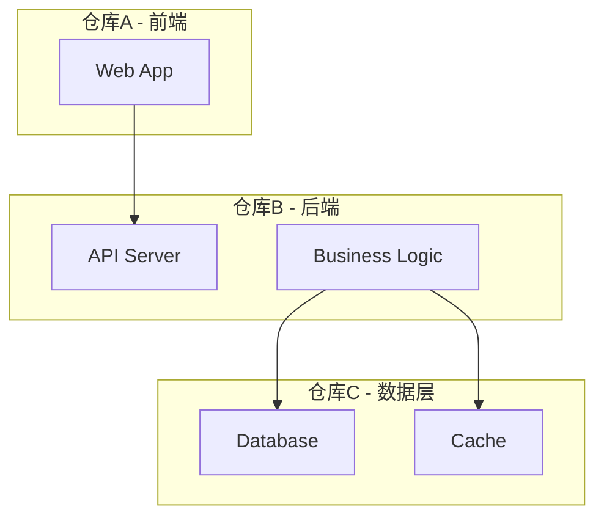
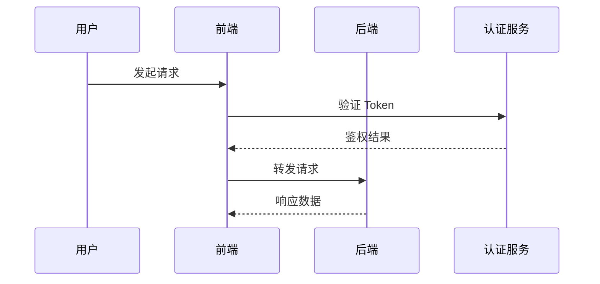

# Wiki 文件结构模板

## Frontmatter 通用模板

每个 `.mdc` 文件必须包含以下 frontmatter：

```yaml
---
description: <语义丰富的上下文说明，包含服务名称、业务概念、技术术语等关键词>
alwaysApply: false
---
```

> `alwaysApply: false` 时，`description` 是 Cursor 判断是否注入该文件的唯一依据。应包含：服务名、核心技术术语、业务概念关键词。

## Description 示例（Few-shot 锚点）

将 `[服务名]`、`[技术栈]`、`[业务概念]` 替换为实际内容：

```yaml
# index.mdc
description: 多仓库产品架构概述：服务清单、技术栈、整体拓扑、wiki导航；涵盖 [服务名1]、[服务名2]、[服务名3] 整体关系

# architecture.mdc
description: 跨仓库服务架构：[服务名1] 前端、[服务名2] API网关、[服务名3] 业务服务；部署拓扑、技术选型（[技术栈关键词]）、基础设施依赖

# relations.mdc
description: 服务间调用关系：[服务名1] 调用 [服务名2] REST API、[服务名2] 依赖 [服务名3] 数据模型；同步调用链、共享 DTO

# data-flow.mdc
description: 跨服务数据流：[核心业务链路] 主链路、[认证方式] 鉴权流程、[MQ或定时任务] 异步事件处理
```

## 4 个 Wiki 文件内容维度

### index.mdc — 整体概述与导航

- 产品简介（1-2 句话）
- 服务清单表格（服务名、仓库路径、技术栈、核心职责）
- 整体拓扑示意（文字描述，非图）
- 其他 3 个 wiki 文件的说明与导航

### architecture.mdc — 跨仓库服务架构

- mermaid 架构图（见下方规范）
- 各仓库技术栈说明
- 基础设施依赖（数据库、缓存、消息队列、网关等）
- 部署拓扑说明

### relations.mdc — 服务间关联关系

- 调用关系表格（调用方、被调用方、协议、接口/方法、用途）
- 共享数据模型说明（模型名、涉及仓库、使用方式）
- 配置引用清单（哪个仓库依赖了哪个服务的地址/端口）

### data-flow.mdc — 跨服务数据流

- 核心业务主链路（mermaid 时序图或流程图）
- 认证鉴权流程（OPPO 云 / 4A 流程说明）
- 权限管理逻辑
- 异步事件处理（定时任务、MQ 生产/消费关系）

## Mermaid 图表规范

**架构图（architecture.mdc）**：



**数据流图（data-flow.mdc）**，使用 `sequenceDiagram` 或 `graph LR`：


